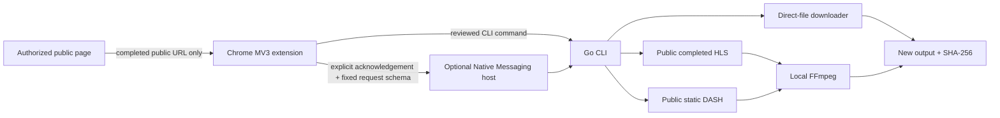

# Open Stream Saver — Architecture

## Purpose

Open Stream Saver is a local-first project for **media a user is already authorized to save**. It divides responsibility among a Chrome Manifest V3 extension, an optional Native Messaging host, and a Go download engine. The central design rule is deliberately restrictive: browser identity data never crosses into the downloader, and protected delivery is rejected rather than adapted.



## Directory tree

```text
open-stream-saver/
├── extension/                              # Chrome Manifest V3 extension
│   ├── manifest.json                        # Minimal APIs, optional sites + nativeMessaging
│   ├── background.js                        # Read-only observer, session dedupe, native-message relay
│   ├── popup.html / popup.js / popup.css    # Review, acknowledgement and local-save UI
├── cli/                                    # Go module
│   ├── cmd/open-stream-saver/               # Interactive CLI binary
│   ├── cmd/open-stream-saver-host/          # Chrome Native Messaging host binary
│   └── internal/
│       ├── app/                             # Command model and shared authorized-download entry point
│       ├── direct/                          # Validated direct-file and HTTP Range downloader
│       ├── hls/                             # Completed unencrypted HLS / supported master variants
│       ├── dash/                            # Narrow static unencrypted DASH SegmentTemplate support
│       ├── native/                          # Length-prefixed local message framing and input allowlist
│       ├── retry/                           # Bounded, context-aware exponential backoff
│       ├── integrity/                       # Local SHA-256 output reports
│       ├── safety/                          # Public URL / DNS target checks
│       ├── ffmpeg/                          # Parameterized local-only FFmpeg merge calls
│       └── progress/                        # Terminal progress abstraction
├── native-host/                             # Native host manifest template and installation guide
├── docs/                                    # FAQ, research, community and security material
├── .github/workflows/release.yml            # Tests + tag-triggered GoReleaser publication
├── .goreleaser.yaml                         # Cross-platform archive recipe
├── README.md / README.zh-CN.md              # Bilingual public documentation
└── LICENSE                                  # Apache-2.0
```

## Core dependencies

| Component | Dependency | Why it is included |
| --- | --- | --- |
| CLI command model | `github.com/spf13/cobra` | Provides explicit commands, flags, help, validation and a stable native-host call boundary. [1] |
| Terminal progress | `github.com/vbauerster/mpb/v8` | Renders local byte or segment progress without introducing a remote control plane. |
| HLS parsing | `github.com/Eyevinn/hls-m3u8` | Parses HLS grammar so the CLI can select only eligible public variants and reject keys, partial segments and other unsupported forms. [2] |
| Worker coordination | `golang.org/x/sync/errgroup` | Bounds goroutines, propagates cancellation, and surfaces the first task failure. |
| DASH parsing, HTTP, XML, hashes | Go standard library | Keeps the static MPD parser, public URL validation, retry policy and SHA-256 behavior auditable without a large downloader framework. |

## Browser and host contract

The extension uses `webRequest.onCompleted` in observer-only mode after the user grants optional site access. It stores only a URL, kind, discovery time and non-sensitive initiator value in session storage, limited to 40 entries per tab. It does **not** request `webRequestBlocking`, `cookies`, `debugger`, `scripting`, or broad persistent host access. It never injects a `fetch`/`XMLHttpRequest` hook and never sees request headers, response headers, browser storage, tokens, credentials, page bodies, keys, or media buffers.

The optional local host is registered through Chrome Native Messaging. Its manifest has an exact `allowed_origins` entry, not a wildcard. Chrome sends a length-prefixed JSON message over standard I/O; the host allows only `action`, `url`, `fileName`, `workers`, `variant`, and `acknowledgeRights`. Unknown fields, oversized messages, missing acknowledgement, arbitrary paths, and invalid worker counts are rejected. Chrome documents this protocol, the one-megabyte host-to-browser limit, and the fixed origin allowlist requirement. [3]

## Download engine contract

The engine validates each initial, manifest, base, and segment URL as a public HTTP(S) destination; it rejects localhost, `.local`, private, loopback, link-local, multicast, unspecified, credential-bearing, or redirect targets. A user must acknowledge their rights before a request begins. Output is written to a temporary file or directory, moved into a **new** destination only after completion, then reported with a SHA-256 digest.

| Path | Explicitly supported | Explicitly rejected |
| --- | --- | --- |
| Direct file | Stable public direct URL; Range requests only after advertised capability; sequential fallback | Redirects, unsafe hosts, overwriting an existing file, auth material. |
| HLS | Completed unencrypted media playlist; one public master variant whose audio/video is already muxed | Live playlists, `EXT-X-KEY`, AES-128/SAMPLE-AES, maps, partial segments, byte ranges, gaps, separate renditions, content steering. |
| DASH | One static public MPD period, direct `SegmentTemplate`, a highest-bandwidth video representation and optional audio representation | `ContentProtection` / DRM, dynamic MPDs, `SegmentTimeline`, `SegmentBase`, `SegmentList`, signed or authenticated delivery. |

HLS and DASH only call FFmpeg with local manifest-generated temporary file paths and fixed arguments; remote URLs, shell fragments, credentials and keys are never passed to FFmpeg. Worker pools are capped at 32. Network-only failures receive bounded exponential backoff; malformed, unauthorized and unsupported inputs fail immediately.

## References

[1]: https://github.com/spf13/cobra "Cobra — modern Go CLI"
[2]: https://github.com/Eyevinn/hls-m3u8 "Eyevinn — hls-m3u8"
[3]: https://developer.chrome.com/docs/extensions/develop/concepts/native-messaging "Chrome for Developers — Native messaging"
