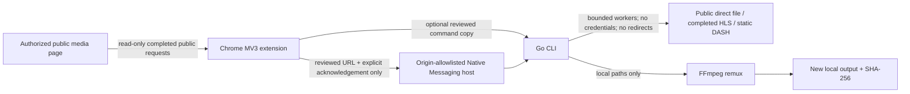

# Media Archiver

<p align="center">
  <strong>A local-first Chrome MV3 companion and Go CLI for user-authorized public media.</strong>
</p>

<p align="center">
  <a href="#quick-start">Quick start</a> ·
  <a href="#browser-extension-and-local-host">Browser extension</a> ·
  <a href="#support-matrix">Support matrix</a> ·
  <a href="#security-boundary">Security boundary</a>
</p>

<!-- Banner placeholder: add a 1280 × 400 project banner here. -->

[](https://go.dev/)
[](https://developer.chrome.com/docs/extensions/)
[](LICENSE)
[](https://github.com/w1977-0/media-archiver/actions/workflows/release.yml)
[](../../releases)

Media Archiver helps a user review and save **public media they are already authorized to archive**. Its Chrome Manifest V3 extension observes eligible public `.mp4`, `.m3u8`, and `.mpd` requests in the current tab. The Go engine saves one direct file, completed unencrypted HLS presentation, or static unencrypted DASH presentation after an explicit acknowledgement of rights.

## Product relationship

**Media Archiver is the formal cross-platform core**: a Go CLI plus Chrome Manifest V3 companion for transparent, local-first handling of authorized public media. [Media Saver](https://github.com/w1977-0/media-saver) is its earlier research-stage local GUI, built with Python, Flask, and Streamlit for a simpler on-device workflow. The projects are deliberately complementary rather than duplicate implementations: this repository is the maintained CLI and browser-extension foundation.

> **Authorization and privacy are design constraints.** The project neither collects nor forwards cookies, authorization headers, tokens, credentials, page bodies, browser storage, encryption keys, or DRM material. It does not bypass logins, subscriptions, paywalls, regional restrictions, proxy controls, encryption, or DRM.

## Features

| Component | What it does |
| --- | --- |
| **Chrome MV3 extension** | Optional read-only site access, per-tab session-scoped deduplication, no traffic modification, and a user-confirmed local-save action. |
| **Native Messaging host** | A locally installed, origin-allowlisted bridge that accepts only a fixed public-URL task schema; it rejects unknown fields and arbitrary output paths. |
| **Go CLI** | Explicit rights acknowledgement, bounded concurrency of **1–32** workers, atomic output, SHA-256 output report, safe URL validation, and bounded exponential backoff. |
| **Direct files** | Uses validated HTTP byte ranges only when the server advertises stable range support; otherwise falls back to one sequential request. |
| **HLS** | Supports completed, unencrypted media playlists and selected muxed variants from a public master playlist; FFmpeg remuxes already-downloaded local segments. |
| **DASH** | Supports a narrow static, unencrypted SegmentTemplate profile; independently downloads public video and audio representations, then locally remuxes them with FFmpeg. |
| **Releases** | A `v*` tag runs tests on Linux, macOS, and Windows, then GoReleaser builds CLI + local-host packages for Linux, macOS, and Windows (AMD64/ARM64) with `SHA256SUMS.txt`. |

## Architecture



The browser component never intercepts page scripts, rewrites `fetch`/`XMLHttpRequest`, modifies traffic, or observes request headers. The local host is optional; the CLI remains the most transparent route because it lets users review the exact URL and command before starting.

## Quick start

### One-command source install

With Go 1.25+ installed, this command installs the CLI from the tagged source:

```bash
go install github.com/w1977-0/media-archiver/cli/cmd/open-stream-saver@latest
```

Alternatively, download your platform archive from [Releases](../../releases). HLS and DASH remux require a locally installed **FFmpeg** on `PATH`; direct-file downloads do not. Use the [installation verification checklist](docs/INSTALLATION_VERIFICATION.md) for expected results from a canonical module install, source build, FFmpeg check, and unpacked extension load.

```bash
# Review the URL and use only when you have permission to save the public media.
open-stream-saver download \
  --url 'https://example.org/your-authorized-video.mp4' \
  --acknowledge-rights \
  --output ./downloads/my-video.mp4
```

The CLI refuses to start without `--acknowledge-rights`, refuses redirects and non-public network targets, and does not overwrite an existing output file.

### Choose a public HLS variant

```bash
open-stream-saver inspect-hls --url 'https://example.org/your-authorized-master.m3u8'
open-stream-saver download \
  --url 'https://example.org/your-authorized-master.m3u8' \
  --variant 1 \
  --acknowledge-rights \
  --output ./downloads/my-video.mp4
```

`--variant -1` is the default and selects the highest advertised supported muxed variant. Separate audio/video rendition groups are intentionally rejected rather than guessed.

## Browser extension and local host

Until an appropriate browser-store review is completed, load the unpacked extension:

1. Open `chrome://extensions`, enable **Developer mode**, and choose **Load unpacked**.
2. Select this repository's `extension/` directory.
3. Open the popup and choose **Enable discovery**. Chrome then asks for optional HTTP/HTTPS site access.
4. On a page where you are authorized to save content, review the discovered public URL. You can copy the CLI command or, after you tick the rights acknowledgement, choose **Save locally**.

The local-save button is opt-in. Install and register the `open-stream-saver-host` binary using the [Native Messaging host guide](native-host/README.md). Its manifest must list your exact extension ID, so another extension cannot use it.


The extension keeps at most 40 URL records per tab in session storage and removes them when the tab closes. It does not send data to a remote service and does not read cookies, headers, page bodies, or account information.

## Support matrix

| Input or condition | Status | Deliberate behavior |
| --- | --- | --- |
| Public HTTP(S) direct file | Supported | Safe URL checks, range validation where offered, temporary-file cleanup, SHA-256 report. |
| Completed, unencrypted HLS media playlist | Supported | Bounded segment worker pool and local FFmpeg remux. |
| Public HLS master playlist with muxed variants | Supported | `inspect-hls` lists variants; `--variant` selects one safe media playlist. |
| Public static DASH with direct SegmentTemplate video + optional audio | Supported | Chooses the highest advertised representation per track and locally remuxes downloaded files. |
| DRM / `ContentProtection`, encrypted HLS, AES-128, SAMPLE-AES | Rejected | No key acquisition, decryption, or DRM circumvention is implemented. |
| Live HLS/DASH, redirects, HLS byte ranges/maps/partial segments, DASH SegmentTimeline or SegmentBase | Rejected | Avoids partial, ambiguous, or access-sensitive delivery modes. |
| Login-only, cookie-gated, paywalled, region-restricted, token-gated content | Rejected | The project does not import, capture, or forward identity material. |

## Build from source

```bash
git clone https://github.com/w1977-0/media-archiver.git
cd media-archiver/cli
go test ./...
go vet ./...
go build -o ../bin/open-stream-saver ./cmd/open-stream-saver
go build -o ../bin/open-stream-saver-host ./cmd/open-stream-saver-host
```

Use `goreleaser check` from the repository root to validate the release configuration. Releases intentionally **do not bundle FFmpeg**: it is a separately maintained system component that users should obtain through their operating system or a trusted upstream distributor.

## Security boundary

This repository is for personal archiving of material you are allowed to save, such as your own uploads, openly licensed work, content covered by an agreement, or media a site explicitly permits you to download. It is not legal advice and cannot determine your rights.

Please do not open issues or pull requests for Cookie/Token capture, custom authenticated headers, page interception hooks, login automation, encryption-key retrieval, AES/SAMPLE-AES decryption, DRM workarounds, paywall or regional bypasses, proxy rotation, bulk harvesting, or request modification. Such capabilities are expressly outside this project.

For implementation details, see [ARCHITECTURE.md](ARCHITECTURE.md), [CONTRIBUTING.md](CONTRIBUTING.md), [docs/FAQ.md](docs/FAQ.md), [SECURITY.md](SECURITY.md), and [CODE_OF_CONDUCT.md](CODE_OF_CONDUCT.md). Do not post private URLs, account information, credentials, tokens, DRM keys, or content you are not authorized to share.

## License

Licensed under the [Apache License 2.0](LICENSE). Third-party dependencies retain their own licenses; see [NOTICE.md](NOTICE.md).
